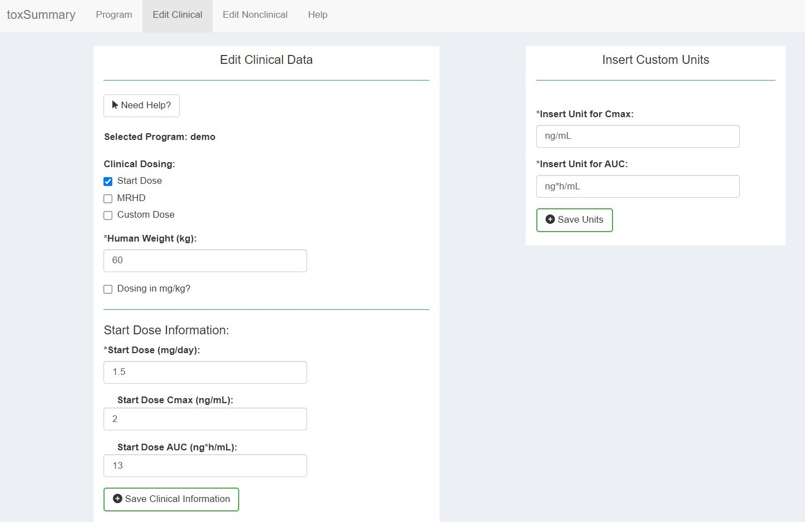
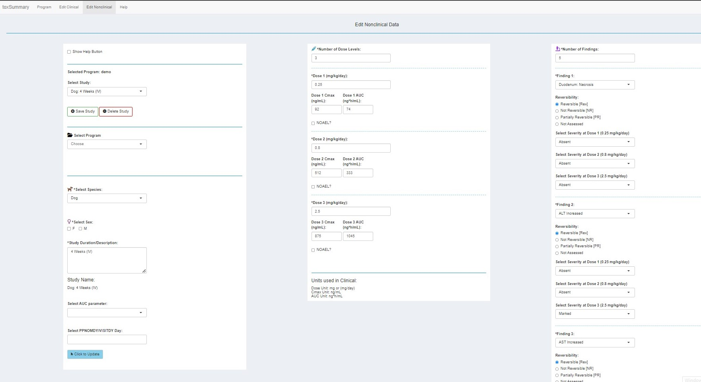
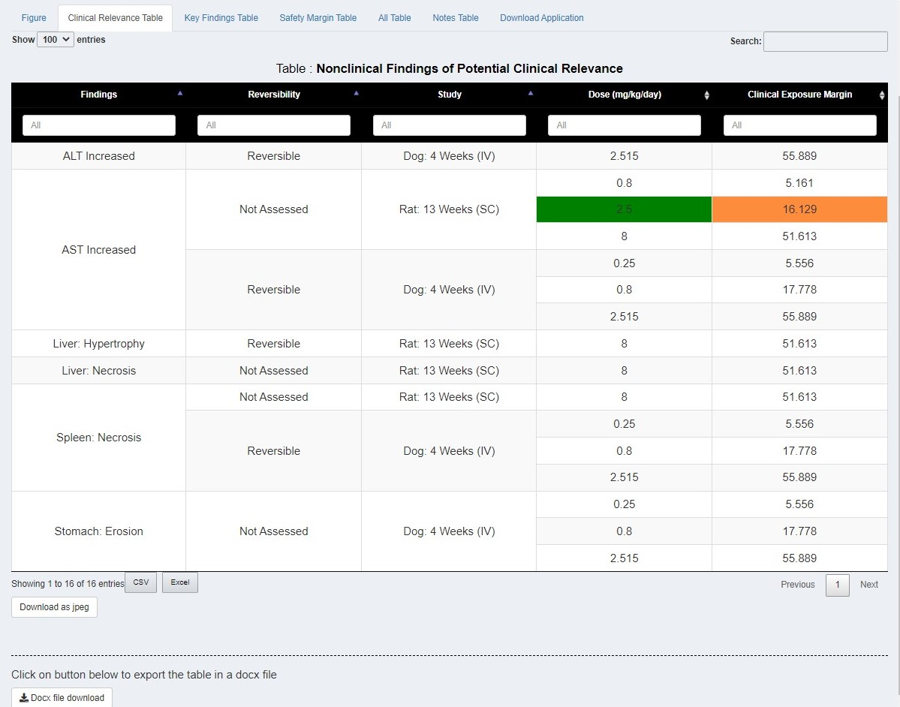

```{r, include = FALSE}
knitr::opts_chunk$set(
  collapse = TRUE,
  comment = "#>"
)
```

```{r setup}
library(toxSummary)
```
## Overview
For an Active Pharmaceutical Ingradient (API), multiple studies are done in
animals.  Pharmacologist or toxicologist may want to compare among the studies. 
So plot shows all doses, exposure margin, any user provided notes, and findings
with degree of severity. Plot can be customized with other input button like
sliders, drag and drop and checkbox. App also generate multiple summary table
for all the studies.  Summary table also highly customizable as user needed. 

<a href="https://github.com/phuse-org/toxSummary"></a>

## Application Tab  
On the landing page (Application tab) there is a button  
on bottom of the left sidebar called "Need Help?".  
When user click on the button it will show how to use the app and
will provide self guided tour for all the button in this page.

## Edit Clinical Tab  
There is a button on top of the left column called "Need Help?".   When user
click on the button will provide self guided tour for all the button in this
page.  

 <a href="https://github.com/phuse-org/toxSummary"></a>

## Edit Nonclinical Tab    
There is a button on top of the left column called "Show Help Button". 
When user click on this button, it will show two other button   
1. Need Help? start here  
2. Manual Entry  
These button will provide self guided tour to this page and give information
what all input button does and how to enter data here.

<a href="https://github.com/phuse-org/toxSummary"></a>

## Database Connection
User can enter nonclinical data manually or nonclinical data can be filled out 
from database. To extract from database, user need to create a SQLite database
from Standard for Exchange of Nonclinical Data (SEND). Instruction for how to
create SEND database can be found here
[https://github.com/phuse-org/sendigR](https://github.com/phuse-org/sendigR).
When user choose to connect to database, user need one more csv file that map 
studies to a corresponding number. An example file can be found here 
[link](https://github.com/phuse-org/toxSummary/blob/master/test_data/IND_with_studies_2.csv).

|                      |             |             |
|:--------------------:|:-----------:|:-----------:|
| **application_type** | **IND_num** | **studyID** |
| IND                  | 155580      | CJ16050     |
| IND                  | 155580      | CJUGSEND00  |
| IND                  | 155580      | Study ID    |
| IND                  | 155581      | Nimort-01   |
| IND                  | 155581      | PC201708    |
| IND                  | 155582      | GLP003      |
| IND                  | 155582      | PDS2014     |
| IND                  | 155582      | CV01        |


for above example, studyID GLP003, PDS2014 and CV01 all belong to IND_num
155582.  IND means Investigational New Drug which might be FDA specific but user
can choose how they want to map. When create csv file, keep the column name same
as shown above.


## Plot   
When user create an application and add study information, app will create plot
and plot will be shown on Application Tab.  The plot is can be think of as two
subplot.  On the left plot, one big rectangular represents one study and small
rectangular box represents dose. If the color of small rectangular box is green,
it represent No Observed Adverse Effect Level (NOAEL) dose. Other doses are
colored black.  Mouse hovering on dose box will show exposure margin. User can
select to show dose and exposure margin same time from checkbox.  On the right
plot, dose box is color coded with degree of severity of finding.  Mouse
hovering on box will show finding.  The whole plot can be customized by changing
the different input located at the top of the plot.

## Tables
App generate multiple summary plots located right side of figure tab.  Clinical
relevance table group by findings. Use can look into which finding is common
across studies. Table also show reversibility, dose and exposure margin
information.  The key finding table show all the findings that are  found at
greater than NOAEL dose for a study. Table also include NOAEL, Cmax, AUC and
safety margin  column.  The safety margin table show all the studies that have
NOAEL dose. It filter out all the other study that does not have NOAEL dose.
Table include NOAEL, HED (human equivalent dose) Cmax, AUC, safety margin at
proposed clinical dose.
There is a notes table that show all the notes if user provided note while 
adding the study in nonclinical section. 
All the table can be downloaded as csv, Excel and microsoft word file. 

<a href="https://github.com/phuse-org/toxSummary"></a>

## More information
For more information, please visit following website
- [GitHub Repository](https://github.com/phuse-org/toxSummary)
- [toxSummary Website](https://phuse-org.github.io/toxSummary/)